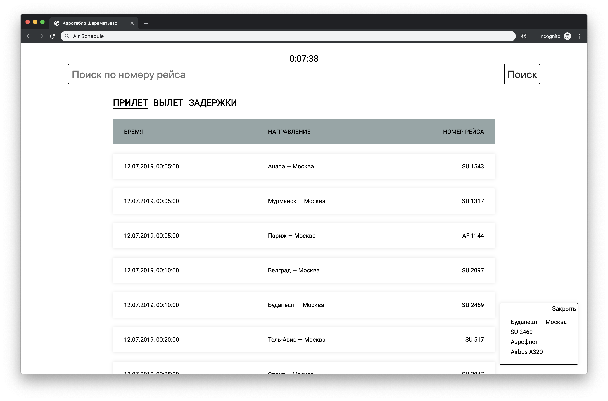

# Тестовое задание "табло аэропорта"



## Задание

Разработайте клиентское приложение(сайт), где будет табло аэропорта. У табло должны быть следующие функции:

* просмотр только вылетающиих рейсов
* просмотр только прилетающих рейсов
* просмотр задержанных рейсов
* поиск по номеру рейса

В качестве примера можно посмотреть на [табло Шереметьево](http://www.svo.aero).

## Запуск

```bash
npm install
npm run build:prod
API_TOKEN=your-api-token npm run server
```

### Использованные технологии

* node.js
* webpack
* mustache
* Sass
* API Яндекс расписания
* fetch
* архитектура приложения - SPA
